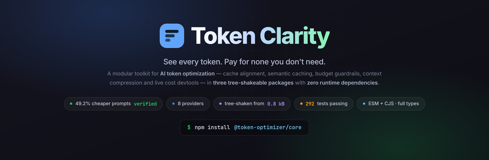
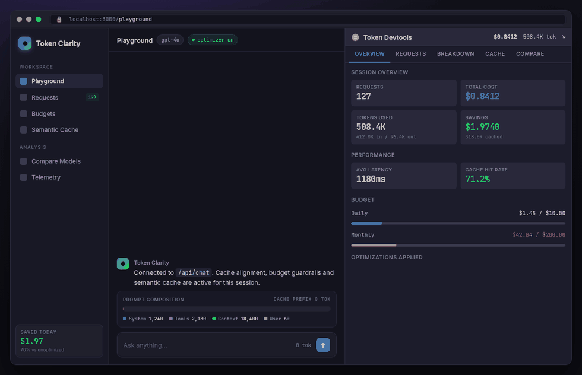
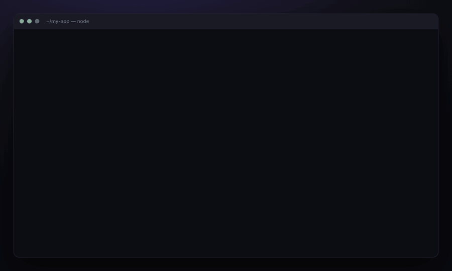
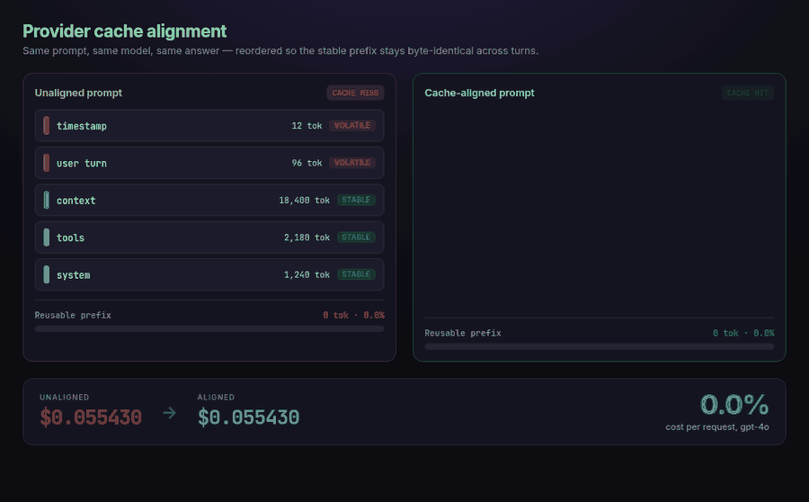
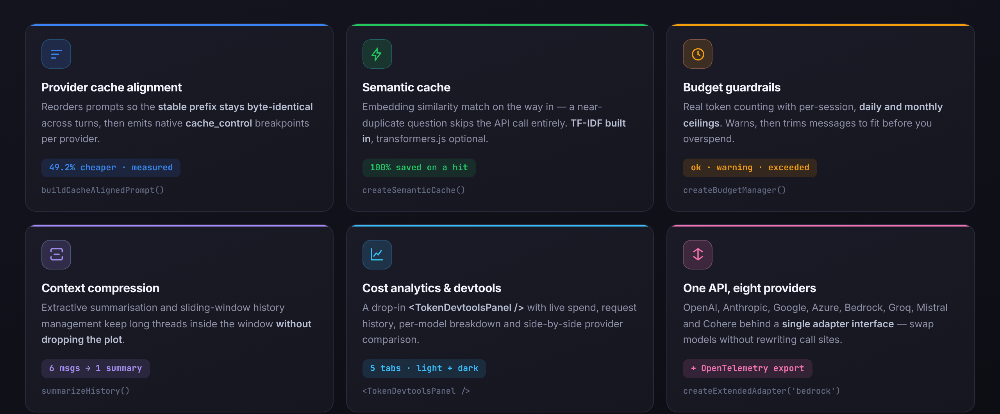
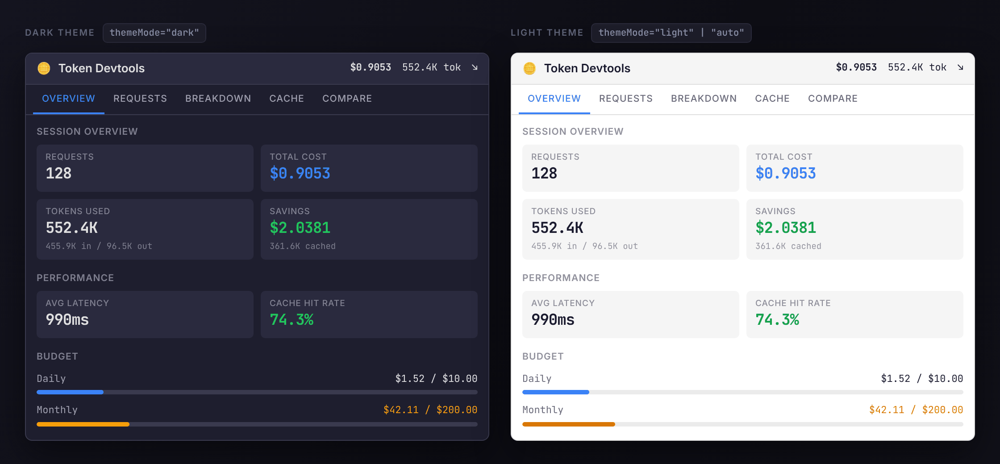
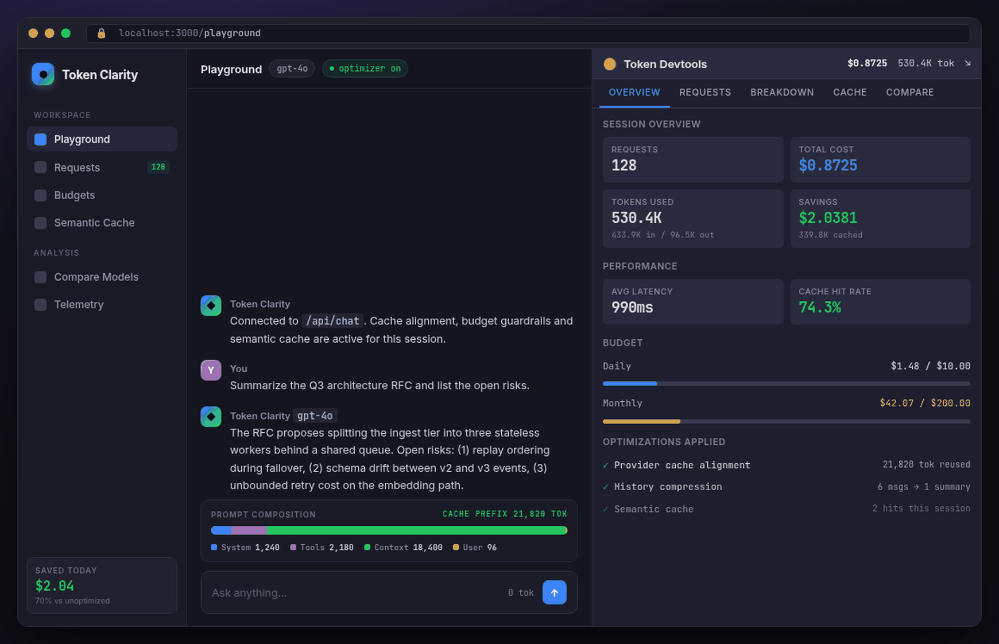
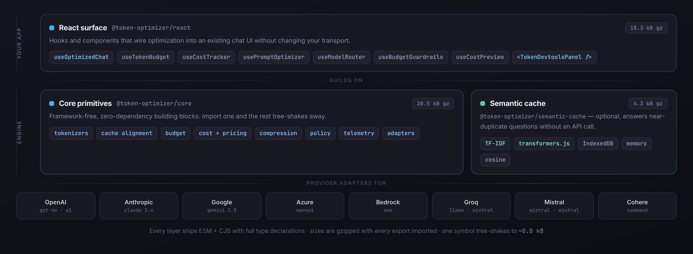

<div align="center">



<br>

[](https://github.com/christireid/token-clarity/actions/workflows/ci.yml)
[](#quality)
[](#packages)
[](#packages)
[](#packages)
[](./LICENSE)

**Client-side token optimization for LLM apps — cache alignment, semantic caching, budget guardrails,<br>context compression and live cost devtools. Three tree-shakeable packages, zero runtime dependencies.**

[See it working](#see-it-working) · [Quick start](#quick-start) · [How it saves money](#how-it-saves-money) · [Devtools](#the-devtools-panel) · [API](#api-reference)

</div>

---

## See it working

A chat app wired up with `useOptimizedChat` and `<TokenDevtoolsPanel />`. Every token, every dollar, every cache hit — visible while you build.

<div align="center">
  
</div>

<sub>The panel is a real component you drop into your app — five tabs, live metrics, no backend required.</sub>

---

## Quick start

```bash
npm install @token-optimizer/core @token-optimizer/react
```

> **Status: pre-release.** `v0.1.0` is not published to npm yet — install from this repo (`pnpm install && pnpm build`) while the first release is prepared. The API below is what ships.

```tsx
import { TokenOptimizerProvider, useOptimizedChat, TokenDevtoolsPanel } from '@token-optimizer/react';

export default function App() {
  return (
    <TokenOptimizerProvider
      config={{
        defaultModel: 'gpt-4o',
        defaultProvider: 'openai',
        globalBudget: { daily: 10.0 },
      }}
    >
      <Chat />
      <TokenDevtoolsPanel position="bottom-right" themeMode="auto" />
    </TokenOptimizerProvider>
  );
}

function Chat() {
  const { messages, input, setInput, sendMessage, isLoading, tokenBudget, costTracker } =
    useOptimizedChat({
      api: '/api/chat',
      model: 'gpt-4o',
      provider: 'openai',
      enableCacheAlignment: true,
      enableCostTracking: true,
    });

  return (
    <>
      <header>
        Budget: {tokenBudget.status} · Spent: ${costTracker.sessionCost.toFixed(4)} · Saved: $
        {costTracker.totalSavings.toFixed(4)}
      </header>

      {messages.map((m, i) => (
        <p key={i}>
          <b>{m.role}:</b> {m.content}
        </p>
      ))}

      <input
        value={input}
        onChange={(e) => setInput(e.target.value)}
        onKeyDown={(e) => e.key === 'Enter' && sendMessage()}
        disabled={isLoading}
      />
    </>
  );
}
```

That's the whole integration. Your transport doesn't change — `useOptimizedChat` still `POST`s to your own `/api/chat`.

<div align="center">
  
</div>

---

## How it saves money

### 1. Provider cache alignment

Every major provider will bill a cached prefix at a steep discount — but only if the prefix is **byte-identical** to the previous request. One volatile token near the top (a timestamp, a shuffled tool list, the user's turn) invalidates everything after it.

`buildCacheAlignedPrompt()` sorts segments by volatility, places the cache breakpoint at the last stable boundary, and emits the provider's native cache-control shape.

<div align="center">
  
</div>

```ts
import {
  buildCacheAlignedPrompt,
  createSystemSegment,
  createToolsSegment,
  createContextSegment,
  createUserSegment,
  toAnthropicFormat,
} from '@token-optimizer/core';

const prompt = buildCacheAlignedPrompt(
  [
    createSystemSegment('You are a helpful assistant.'),
    createToolsSegment(myTools),
    createContextSegment(longDocument),
    createUserSegment('Summarize this document.'),
  ],
  { provider: 'anthropic' }
);

prompt.estimatedCacheHitRate; // ~0.94 for this shape
prompt.cacheableTokens; // everything above the breakpoint

const request = toAnthropicFormat(prompt); // cache_control breakpoints included
```

<sub>The 49.2% above is computed by this repo's own `estimateCost('gpt-4o', 21916, 64, 21820)` against the bundled pricing table — `$0.055430 → $0.028155`. Anthropic's 90%-off cached input pushes the same prompt further.</sub>

### 2. Semantic cache

A near-duplicate question doesn't need a second API call. Embedding similarity match on the way in, TF-IDF built in, `transformers.js` optional for real embeddings.

```ts
import { createSemanticCache } from '@token-optimizer/semantic-cache';

const cache = await createSemanticCache({ storage: 'indexeddb', similarityThreshold: 0.92 });

const hit = await cache.get('How do I sort an array?');
if (hit.hit) return hit.entry.response; // similarity 0.94 — 100% of that call saved

await cache.set(query, response, { model: 'gpt-4o', tokens: { input: 50, output: 200 } });
```

### 3. Budget guardrails

Count first, spend second. Trim to fit rather than fail at the provider.

```ts
import { createBudgetManager, getModelBudget } from '@token-optimizer/core';

const manager = createBudgetManager(getModelBudget('gpt-4o'));

manager.checkBudget(5000, 1000).status; // 'ok' | 'warning' | 'critical' | 'exceeded'

const { messages, tokensSaved } = manager.trimToFit(history, { reserveForOutput: 2000 });
```

### 4. Context compression

Extractive summarisation and sliding windows keep long threads inside the context window without losing the plot.

```ts
import { summarizeHistory, slidingWindowContext, compressExtractive } from '@token-optimizer/core';
```

---

## Everything in the box

<div align="center">
  
</div>

---

## The devtools panel

`<TokenDevtoolsPanel />` is a single import with five tabs — **Overview**, **Requests**, **Breakdown**, **Cache** and **Compare**. It reads from the same context your hooks write to, so it costs you one line.

```tsx
<TokenDevtoolsPanel position="bottom-right" themeMode="auto" devOnly />
```

<div align="center">
  
</div>

| Tab | What it answers |
|-----|-----------------|
| **Overview** | What has this session cost, and how close am I to the daily/monthly ceiling? |
| **Requests** | Which call was slow, which was expensive, which hit cache? |
| **Breakdown** | Where is the spend concentrated — by model and by provider? |
| **Cache** | What is my hit rate, and what would this have cost without caching? |
| **Compare** | What would the same workload cost on every other model? |

Themes are fully overridable via `mergeTheme()`, and `devOnly` strips the panel from production builds.

<details>
<summary><b>Static screenshot of the full playground</b></summary>

<br>



</details>

---

## Packages

<div align="center">
  
</div>

| Package | What it's for | Every export | Runtime deps |
|---------|---------------|--------------|--------------|
| [`@token-optimizer/core`](./packages/core) | Framework-free primitives — tokenizers, cache alignment, budget, cost, compression, policy, telemetry, adapters | 28.5 kB | none |
| [`@token-optimizer/react`](./packages/react) | Hooks, provider and the devtools panel | 18.3 kB | `core` |
| [`@token-optimizer/semantic-cache`](./packages/semantic-cache) | Optional embedding cache with IndexedDB / memory storage | 4.3 kB | `core` |

**You almost never pay that.** The "every export" column is the whole package gzipped; the packages are pure
ESM with `sideEffects: false`, so a real import tree-shakes down hard:

| What you import | Bundled + minified + gzipped |
|-----------------|------------------------------|
| `estimateCost` | **0.8 kB** |
| `buildCacheAlignedPrompt` | **1.1 kB** |

<sub>Reproduce with `pnpm build`, then `esbuild --bundle --minify --format=esm` a one-line re-export and gzip the
result. Everything ships ESM + CJS with full `.d.ts` declarations. Tokenizers (`gpt-tokenizer`) and real
embeddings (`@xenova/transformers`) are lazy-loaded optional peers, so they never land in your main bundle —
`estimateTokens()` needs neither.</sub>

---

## API reference

<details>
<summary><b>Token counting</b></summary>

```ts
import { createTokenizer, estimateTokens, estimateChatTokens } from '@token-optimizer/core';

estimateTokens('Hello, world!'); // 4 — zero dependencies, synchronous, no lazy load

const tokenizer = await createTokenizer('gpt-4o'); // lazy-loads the real tokenizer
tokenizer.count('Hello, world!'); // 4
tokenizer.countChat([
  { role: 'user', content: 'Hello!' },
  { role: 'assistant', content: 'Hi there!' },
]);
```

</details>

<details>
<summary><b>Cost tracking</b></summary>

```ts
import { estimateCost, createUsageTracker } from '@token-optimizer/core';

const cost = estimateCost('gpt-4o', 1000, 500, 800); // in, out, cached
cost.totalCost;
cost.savings?.fromCache;

const tracker = createUsageTracker({ persistKey: 'my-app' });
tracker.trackRequest({ model: 'gpt-4o', inputTokens: 1000, outputTokens: 500, cost: cost.totalCost });
tracker.getSessionStats();
```

Pricing lives in `MODEL_PRICING` and can be refreshed at runtime with `updatePricing()` / `RemotePricingFetcher`.

</details>

<details>
<summary><b>React hooks</b></summary>

| Hook | Returns |
|------|---------|
| `useOptimizedChat` | `messages`, `input`, `setInput`, `sendMessage`, `isLoading`, `error`, `tokenBudget`, `costTracker`, `lastRequest`, `addMessage`, `removeMessage`, `clearMessages` |
| `useTokenBudget` | `status`, `tokenizer`, `isLoading`, `countTokens`, `countMessages`, `checkBudget`, `trimMessages`, `remainingInput`, `remainingOutput` |
| `useCostTracker` | `sessionCost`, `totalSavings`, `savingsPercent`, `trackRequest`, `estimateNext`, `budgetStatus`, `budgetRemaining` |
| `usePromptOptimizer` | `buildPrompt`, `toProviderRequest`, `cacheableTokens`, `setSystemPrompt`, `setTools`, `setContext` |
| `useModelRouter` | Route each request to the cheapest model that clears a quality bar |
| `useBudgetGuardrails` | Block or downgrade requests that would breach a ceiling |
| `useCostPreview` | Price a request *before* sending it |
| `useDevtools` | The metrics stream behind `<TokenDevtoolsPanel />` |
| `useSemanticCache` | `isReady`, `stats`, `checkCache`, `cacheResponse`, `withCache` |

```tsx
const { status, checkBudget, trimMessages } = useTokenBudget({
  model: 'gpt-4o',
  maxInputTokens: 4096,
  onWarning: (s) => console.warn('Approaching limit', s),
});
```

```tsx
import { useSemanticCache } from '@token-optimizer/semantic-cache/react';

const { withCache } = useSemanticCache({ storage: 'indexeddb', similarityThreshold: 0.9 });

const result = await withCache(query, () => fetch('/api/chat').then((r) => r.json()), {
  extractResponse: (data) => data.response,
});
```

</details>

<details>
<summary><b>Provider adapters &amp; telemetry</b></summary>

Adapters give you one interface for counting, pricing, and message/response normalisation across providers.

```ts
import { createExtendedAdapter, getAdapter, toProviderFormat } from '@token-optimizer/core';

// All eight providers (plus any OpenAI-compatible endpoint)
const bedrock = createExtendedAdapter('bedrock');
await bedrock.countMessages(messages);
bedrock.estimateCost({ input: 1000, output: 500, total: 1500 }, 'claude-3-5-sonnet');

// The three first-class providers are also in a global registry
getAdapter('anthropic'); // openai | anthropic | google — extend it with registerAdapter()

// ...and a cache-aligned prompt becomes a native request shape
const request = toProviderFormat(prompt, 'anthropic', myTools);
```

<sub>Two entry points, on purpose. `getAdapter()` reads the global registry, which is seeded with the three
providers in the `Provider` union (`openai`, `anthropic`, `google`) and extended via `registerAdapter()`.
`createExtendedAdapter()` constructs any `ExtendedProvider` directly — Azure, Bedrock, Groq, Mistral, Cohere
and `openai-compatible` included. Request formatting (`toProviderFormat()`) emits OpenAI, Anthropic and Google
shapes; Azure/Groq/Mistral/Cohere consume the OpenAI shape and Bedrock the Anthropic one.</sub>

```ts
import { createTelemetryCollector, createOTLPExporter } from '@token-optimizer/core';

const telemetry = createTelemetryCollector({ enabled: true, sampleRate: 1 });
telemetry.addExporter(createOTLPExporter('https://otel.example.com/v1/traces'));
```

Exporters ship for OTLP, plain HTTP, JSON Lines, console, memory and arbitrary callbacks.

</details>

---

## Supported models

| Provider | Models with bundled pricing | Adapter |
|----------|------------------------------|---------|
| **OpenAI** | GPT-4o, GPT-4o-mini, GPT-4-turbo, GPT-4, GPT-3.5-turbo, o1, o1-mini | `openai` |
| **Anthropic** | Claude 3 Opus, Claude 3.5 Sonnet, Claude 3 Sonnet, Claude 3 Haiku | `anthropic` |
| **Google** | Gemini 1.5 Pro, Gemini 1.5 Flash, Gemini Pro, Gemini Ultra | `google` |
| **Open weights** | Llama 3, Llama 3.1, Mistral, Mixtral | `groq`, `mistral` |
| **Azure · Bedrock · Cohere** | Priced through the underlying OpenAI / Anthropic entries | `azure`, `bedrock`, `cohere` |

Model names are normalised before lookup (`gpt-4o-2024-08-06` → `gpt-4o`), and anything unrecognised falls back
to conservative default pricing rather than throwing. `updatePricing()` lets you override the table at runtime
when a provider changes its rates.

---

## Quality

```
✓ 12 test files · 292 tests passing        pnpm test
✓ strict TypeScript across 3 packages      pnpm typecheck
✓ ESLint + Prettier                        pnpm lint
✓ token accuracy + cost regression checks  packages/core/benchmarks
```

CI runs lint, typecheck and the full suite on every push and pull request.

---

## Contributing

Issues and pull requests are welcome — see the [Contributing Guide](./CONTRIBUTING.md).

```bash
pnpm install     # install the workspace
pnpm build       # build all three packages
pnpm test        # run the suite
pnpm changeset   # describe your change for the next release
```

Background reading lives in [`docs/`](./docs), [`research/`](./research) and [`reports/`](./reports).

---

## License

[MIT](./LICENSE) © Token Optimizer Contributors
